# 航電系統連線與基本硬體規格表 (Avionics Golden Reference)

> [!NOTE]
> 本文件為 **RocketCom 航電系統主控板** 的官方硬體規格與引腳分配黃金參考手冊（Golden Reference）。
> 旨在提供後續 AI 程式開發代理人 (AI Agent) 與韌體工程師在撰寫 STM32 C/C++ 韌體（HAL/LL 庫）或 Arduino 測試程式時，能擁有 100% 精確的硬體對照指引，免去反覆查閱 KiCad 原理圖與 PCB 佈線檔的繁瑣步驟。

---

## 1. 系統核心架構簡介

本系統採用 **四層堆疊板 (4-Layer Stacked Design)** 架構，主要包含以下層次：
1. **頂層介面與感測器層 (Top Layer)**：搭載 GPS 定位模組與地磁計（磁力計）。
2. **主控 MCU 層 (Second Layer MCU)**：系統核心。主控晶片因缺料替代為 **STM32F407VGT6**（與原設計 STM32F405VGT6 之 Pinout 完全一致且相容），板載核心 IMU、高G值加速度計、氣壓計（因缺料改用 **BMP388**，與原設計 BMP390 之 Pinout 完全一致且相容）、高容量 Flash 快閃記憶體與 MicroSD 卡槽。
3. **無線通訊層 (LoRa Layer)**：集成 433MHz（UART 介面）與 920MHz（SPI 介面）雙頻段 LoRa 無線遙測模組。
4. **電源管理層 (Power Layer)**：高效率雙路 DC-DC 降壓、雙電源切換與電池電壓監測系統。

---

## 2. STM32F407VGT6 (LQFP100) 完整引腳分配表 (相容 STM32F405VGT6)

以下為透過電路板佈線實測 100% 導出的物理引腳 (Pad) 與全域網路標籤 (Net Label) 的對照表：

| 引腳 (Pad) | GPIO 名稱 | 連接網路標籤 (Net) | 週邊設備 / 功能描述 | 電源軌 |
| :---: | :---: | :--- | :--- | :---: |
| **1** | **PE2** | `LED_SYS` | 系統運行指示 LED 燈（低電平/高電平控制） | 3.3V |
| **2** | **PE3** | `LED_State1` | 狀態指示 LED 燈 1 | 3.3V |
| **3** | **PE4** | `LED_State2` | 狀態指示 LED 燈 2 | 3.3V |
| **4** | **PE5** | `N/C` | 未連接 (Unconnected) | - |
| **5** | **PE6** | `N/C` | 未連接 (Unconnected) | - |
| **6** | **VBAT** | `+3.3V` | 備用電池電源輸入 | 3.3V |
| **7** | **PC13** | `N/C` | 未連接 (Unconnected) | - |
| **8** | **PC14** | `N/C` | 未連接 (Unconnected) | - |
| **9** | **PC15** | `N/C` | 未連接 (Unconnected) | - |
| **10** | **VSS** | `GND` | 系統地 | 0V |
| **11** | **VDD** | `+3.3V` | 系統數位電源 | 3.3V |
| **12** | **PH0** | `HSE_IN` | 外部高速晶振輸入 (16.0000 MHz) | 3.3V |
| **13** | **PH1** | `HSE_OUT` | 外部高速晶振輸出 | 3.3V |
| **14** | **NRST** | `RESET` | 系統硬體重置腳 | 3.3V |
| **15** | **PC0** | `Battery_Sensing` | 電池電壓類比量測腳 (**ADC1_IN10**) | 類比 |
| **16** | **PC1** | `SUP_STAT` | 電源切換狀態指示（低電平表示 USB 供電中） | 3.3V |
| **17** | **PC2** | `N/C` | 未連接 (Unconnected) | - |
| **18** | **PC3** | `USER_BT2` | 使用者按鍵 2 輸入（帶外部上拉） | 3.3V |
| **19** | **VSSA** | `GND` | 類比地 | 0V |
| **20** | **VREF-** | `GND` | 類比參考地 | 0V |
| **21** | **VREF+** | `VREF` | 類比參考正電壓 (接 +3.3V 濾波) | 3.3V |
| **22** | **VDDA** | `+3.3V` | 系統類比電源 | 3.3V |
| **23** | **PA0** | `Buzzer` | 有源蜂鳴器控制引腳（高電平驅動） | 3.3V |
| **24** | **PA1** | `USER_BT1` | 使用者按鍵 1 輸入（帶外部上拉） | 3.3V |
| **25** | **PA2** | `USART2_TX` | 外部 UART2 傳送 (擴充除錯/串列埠) | 3.3V |
| **26** | **PA3** | `USART2_RX` | 外部 UART2 接收 | 3.3V |
| **27** | **VSS** | `GND` | 系統地 | 0V |
| **28** | **VDD** | `+3.3V` | 系統數位電源 | 3.3V |
| **29** | **PA4** | `CSB_Baro` | BMP388 氣壓計 SPI 片選腳 (**CS**) | 3.3V |
| **30** | **PA5** | `SPI1_SCK` | SPI1 時鐘線 (共用：氣壓計、高G加速度計、Flash) | 3.3V |
| **31** | **PA6** | `SPI1_MISO` | SPI1 主入從出線 | 3.3V |
| **32** | **PA7** | `SPI1_MOSI` | SPI1 主出從入線 | 3.3V |
| **33** | **PC4** | `CSB_HIGH_G` | ADXL375 高G加速度計 SPI 片選腳 (**CS**) | 3.3V |
| **34** | **PC5** | `INT_High_G2` | ADXL375 高G加速度計中斷輸出 2 | 3.3V |
| **35** | **PB0** | `INT_High_G1` | ADXL375 高G加速度計中斷輸出 1 | 3.3V |
| **36** | **PB1** | `INT_Baro` | BMP388 氣壓計中斷輸出腳 | 3.3V |
| **37** | **PB2** | `BOOT1` | 系統啟動模式設定腳 1 | 3.3V |
| **38** | **PE7** | `INT_Accel1` | BMI088 IMU 加速度計中斷輸出 1 | 3.3V |
| **39** | **PE8** | `INT_Accel2` | BMI088 IMU 加速度計中斷輸出 2 | 3.3V |
| **40** | **PE9** | `INT_Gyro1` | BMI088 IMU 陀螺儀中斷輸出 1 | 3.3V |
| **41** | **PE10** | `INT_Gyro2` | BMI088 IMU 陀螺儀中斷輸出 2 | 3.3V |
| **42** | **PE11** | `LORA433_BUSY` | E22-400T30S 433MHz LoRa 狀態忙碌指示腳 (AUX) | 3.3V |
| **43** | **PE12** | `INT_Magn` | MMC5983MA 地磁計中斷輸出腳 | 3.3V |
| **44** | **PE13** | `N/C` | 未連接 (Unconnected) | - |
| **45** | **PE14** | `N/C` | 未連接 (Unconnected) | - |
| **46** | **PE15** | `N/C` | 未連接 (Unconnected) | - |
| **47** | **PB10** | `N/C` | 未連接 (Unconnected) | - |
| **48** | **PB11** | `CSB_Gyro` | BMI088 IMU 陀螺儀 SPI 片選腳 (**CS**) | 3.3V |
| **49** | **VCAP_1** | `VCAP_1` | 內部電壓調節器濾波電容連接端 1 | - |
| **50** | **VDD** | `+3.3V` | 系統數位電源 | 3.3V |
| **51** | **PB12** | `CSB_Accel` | BMI088 IMU 加速度計 SPI 片選腳 (**CS**) | 3.3V |
| **52** | **PB13** | `SPI2_SCK` | SPI2 時鐘線 (專用於 BMI088 IMU 晶片) | 3.3V |
| **53** | **PB14** | `SPI2_MISO` | SPI2 主入從出線 | 3.3V |
| **54** | **PB15** | `SPI2_MOSI` | SPI2 主出從入線 | 3.3V |
| **55** | **PD8** | `N/C` | 未連接 (Unconnected) | - |
| **56** | **PD9** | `UART3_RX` | E22-400T30S 433MHz LoRa 遙測接收端 | 3.3V |
| **57** | **PD10** | `LORA433_M1` | E22-400T30S 433MHz LoRa 模式控制腳 M1 | 3.3V |
| **58** | **PD11** | `LORA433_M0` | E22-400T30S 433MHz LoRa 模式控制腳 M0 | 3.3V |
| **59** | **PD12** | `LORA433_RST` | E22-400T30S 433MHz LoRa 模組硬體重置腳 | 3.3V |
| **60** | **PD13** | `FIRE` | 點火/觸發開關控制引腳（MOSFET 高電平驅動） | 3.3V |
| **61** | **PD14** | `N/C` | 未連接（註：主控板上此腳未拉出，TIM4_CH3 暫留） | - |
| **62** | **PD15** | `N/C` | 未連接 (Unconnected) | - |
| **63** | **PC6** | `USART6_TX` | NEO-M9N GPS 模組序列接收端 (對應 GPS Rx) | 3.3V |
| **64** | **PC7** | `UART6_RX` | NEO-M9N GPS 模組序列傳送端 (對應 GPS Tx) | 3.3V |
| **65** | **PC8** | `SDIO_D0` | MicroSD 卡 SDIO 資料線 0 | 3.3V |
| **66** | **PC9** | `SDIO_D1` | MicroSD 卡 SDIO 資料線 1 | 3.3V |
| **67** | **PA8** | `RST_GPS` | NEO-M9N GPS 模組硬體重置腳（低電平有效） | 3.3V |
| **68** | **PA9** | `USB_VBUS` | USB 連接埠 VBUS 電壓偵測腳 | 5V 容忍 |
| **69** | **PA10** | `N/C` | 未連接 (Unconnected) | - |
| **70** | **PA11** | `USB_D-` | On-Chip USB-OTG FS 資料負線 | 3.3V |
| **71** | **PA12** | `USB_D+` | On-Chip USB-OTG FS 資料正線 | 3.3V |
| **72** | **PA13** | `SWDIO` | SWD 偵錯埠資料線 | 3.3V |
| **73** | **VCAP_2** | `VCAP_2` | 內部電壓調節器濾波電容連接端 2 | - |
| **74** | **VSS** | `GND` | 系統地 | 0V |
| **75** | **VDD** | `+3.3V` | 系統數位電源 | 3.3V |
| **76** | **PA14** | `SWCLK` | SWD 偵錯埠時鐘線 | 3.3V |
| **77** | **PA15** | `CSB_Flash` | W25Q128 快閃記憶體 SPI 片選腳 (**CS**) | 3.3V |
| **78** | **PC10** | `SDIO_D2` | MicroSD 卡 SDIO 資料線 2 | 3.3V |
| **79** | **PC11** | `SDIO_D3` | MicroSD 卡 SDIO 資料線 3 | 3.3V |
| **80** | **PC12** | `SDIO_CK` | MicroSD 卡 SDIO 時鐘線 | 3.3V |
| **81** | **PD0** | `N/C` | 未連接 (Unconnected) | - |
| **82** | **PD1** | `N/C` | 未連接 (Unconnected) | - |
| **83** | **PD2** | `SDIO_CMD` | MicroSD 卡 SDIO 命令線 | 3.3V |
| **84** | **PD3** | `SDIO_DET` | MicroSD 卡槽卡片插入偵測腳 (GPIO 中斷) | 3.3V |
| **85** | **PD4** | `LORA920_INT` | E80-900M23S 920MHz LoRa 中斷腳 (**EXTI4**) | 3.3V |
| **86** | **PD5** | `LORA920_RST` | E80-900M23S 920MHz LoRa 重置腳 | 3.3V |
| **87** | **PD6** | `LORA920_BUSY` | E80-900M23S 920MHz LoRa 狀態忙碌指示腳 | 3.3V |
| **88** | **PD7** | `CSB_LORA920` | E80-900M23S 920MHz LoRa SPI 片選腳 (**CS**) | 3.3V |
| **89** | **PB3** | `SPI3_SCK` | SPI3 時鐘線 (專用於 920MHz LoRa 遙測模組) | 3.3V |
| **90** | **PB4** | `SPI3_MISO` | SPI3 主入從出線 | 3.3V |
| **91** | **PB5** | `SPI3_MOSI` | SPI3 主出從入線 | 3.3V |
| **92** | **PB6** | `N/C` | 未連接 (Unconnected) | - |
| **93** | **PB7** | `I2C1_SCL` | **特殊注意**：硬體實體接線至 I2C1_SCL | 3.3V |
| **94** | **BOOT0** | `BOOT0` | 系統啟動模式設定腳 0 (帶 10k 下拉電阻) | 0V |
| **95** | **PB8** | `I2C1_SDA` | **特殊注意**：硬體實體接線至 I2C1_SDA | 3.3V |
| **96** | **PB9** | `N/C` | 未連接 (Unconnected) | - |
| **97** | **PE0** | `N/C` | 未連接 (Unconnected) | - |
| **98** | **PE1** | `N/C` | 未連接 (Unconnected) | - |
| **99** | **VSS** | `GND` | 系統地 | 0V |
| **100** | **VDD** | `+3.3V` | 系統數位電源 | 3.3V |

> [!WARNING]
> ### 🚨 I2C1 引腳配置重要警告
> 在標準 STM32 預設配置中，`PB6` 通常為 I2C1_SCL，`PB7` 為 I2C1_SDA。
> **但在本航電主控板的實體硬體設計中：**
> * **I2C1_SCL** 連接至 **PB7 (Pad 93)**
> * **I2C1_SDA** 連接至 **PB8 (Pad 95)**
> 在初始化 STM32 HAL/LL 庫或進行 CubeMX/CubeIDE 設定時，**必須手動重定義 Pin 腳映射為 `SCL = PB7`, `SDA = PB8`**，否則地磁計 (MMC5983MA) 將完全無法進行通訊！

---

## 3. 通訊匯流排週邊分配表 (Bus Peripherals)

為維持高可靠性，硬體對通訊匯流排進行了隔離設計，避免單一感測器異常導致全匯流排崩潰：

### 3.1 SPI1 匯流排 (高速，主要感測器與資料快閃記憶體)
* **MCU 引腳**：`SCK = PA5` / `MISO = PA6` / `MOSI = PA7`
* **掛載設備**：
  1. **BMP388 氣壓計**：片選腳 = `PA4 (CSB_Baro)`，最大支援 10MHz SPI 速率 (因晶片缺料替代原設計之 BMP390，引腳完全相容)。
  2. **ADXL375 高G加速度計**：片選腳 = `PC4 (CSB_HIGH_G)`，最大支援 5MHz SPI 速率。
  3. **W25Q128 快閃記憶體**：片選腳 = `PA15 (CSB_Flash)`，最大支援 104MHz SPI 速率。

### 3.2 SPI2 匯流排 (專用於核心姿勢 IMU)
* **MCU 引腳**：`SCK = PB13` / `MISO = PB14` / `MOSI = PB15`
* **掛載設備**：
  1. **BMI088 核心 IMU (加速度計)**：片選腳 = `PB12 (CSB_Accel)`，最大支援 10MHz SPI 速率。
  2. **BMI088 核心 IMU (陀螺儀)**：片選腳 = `PB11 (CSB_Gyro)`，最大支援 10MHz SPI 速率。

### 3.3 SPI3 匯流排 (專用於遠程遙測)
* **MCU 引腳**：`SCK = PB3` / `MISO = PB4` / `MOSI = PB5`
* **掛載設備**：
  1. **E80-900M23S (920MHz LoRa 遙測模組)**：片選腳 = `PD7 (CSB_LORA920)`，硬體重置 = `PD5`，中斷腳 = `PD4`，忙碌腳 = `PD6`。

### 3.4 I2C1 匯流排 (磁力計)
* **MCU 引腳**：`SCL = PB7` / `SDA = PB8` (具外部 2.7k 上拉電阻)
* **掛載設備**：
  1. **MMC5983MA 高精度三軸地磁計**：中斷腳 = `PE12`。

### 3.5 UART 序列通訊匯流排
* **UART3** (`TX = PB10` / `RX = PD9`)：
  * **掛載設備**：**E22-400T30S (433MHz LoRa 模組)**。
  * **控制引腳**：重置 = `PD12`，模式 M0 = `PD11`，模式 M1 = `PD10`，忙碌 AUX = `PE11`。
* **UART6** (`TX = PC6` / `RX = PC7`)：
  * **掛載設備**：**NEO-M9N-00B (GPS 定位模組)**。
  * **控制引腳**：重置 = `PA8`。
* **USART2** (`TX = PA2` / `RX = PA3`)：
  * **用途**：預留外部排針除錯/地面有線通訊埠。

### 3.6 SDIO 匯流排 (大容量數據記錄)
* **MCU 引腳**：`D0=PC8`, `D1=PC9`, `D2=PC10`, `D3=PC11`, `CLK=PC12`, `CMD=PD2`
* **偵測腳**：`SDIO_DET = PD3`（高電平/低電平判斷是否有卡片插入，支援中斷觸發）

---

## 4. 關鍵感測器與晶片規格

為撰寫驅動程式，以下彙整硬體上各晶片的核心規格與介面細節：

### 4.1 BMI088 六軸慣性測量單元 (IMU)
* **功能**：負責火箭飛行姿態、角速度及標準加速度量測（飛行姿態控制核心）。
* **SPI 通訊模式**：SPI Mode 3 (CPOL=1, CPHA=1) 或 Mode 0 (CPOL=0, CPHA=0)。
* **暫存器讀寫規則**：讀取暫存器時，SPI 位元組需包含讀寫控制位元（Bit 7 = 1 表示讀取，0 表示寫入）。加速度計在傳送完暫存器地址後，需要多一個 Dummy Byte 才能讀出有效數據。
* **量程設定建議**：
  * **加速度計**：建議設為 **±24g**（最高支援），頻寬建議設為 280Hz。
  * **陀螺儀**：建議設為 **±2000 °/s**，頻寬建議設為 532Hz。

### 4.2 BMP388 高精度氣壓計 (因缺料替代原設計之 BMP390，Pinout 完全一致)
* **功能**：量測大氣壓力，換算火箭實時高度與垂直爬升速度。
* **SPI 通訊模式**：SPI Mode 3 或 Mode 0。
* **備註**：因晶片缺料，本專案將原先設計的 BMP390 替代為 **BMP388**。兩者實體引腳 (Pinout) 與通訊暫存器操作高度一致，均支援 SPI/I2C 介面，暫存器補償公式相似，開發時可通用。
* **核心參數**：
  * 量測範圍：300hPa 至 1250hPa (相當於海拔 -500米 至 +9000米)。
  * 相對精度：±0.08 hPa (等同於 ±0.66 米)。
  * 驅動公式：同樣必須先讀取晶片內部的非易失性校準係數 (Calib Coefficients)，並套用官方的補償公式進行實時計算。

### 4.3 ADXL375 高G值三軸加速度計
* **功能**：火箭起飛瞬間與火箭引擎燃燒時的高衝擊力（High-G）監測。
* **SPI 通訊模式**：SPI Mode 3。
* **量程與動態範圍**：
  * 測量範圍：固定為 **±200g**。
  * 解析度：10-bit，靈敏度為 49mg/LSB (每個 LSB 代表 49 毫克加速度)。
  * 輸出速率：最高支援 3200Hz。

### 4.4 MMC5983MA 三軸地磁計
* **功能**：高精度羅盤，提供航向角輔助基準。
* **I2C 位址**：`0x30` (7-bit address)。
* **規格參數**：
  * 動態範圍：±8 Gauss (高達 ±8 高斯測量範圍)。
  * 解析度：18-bit，極低噪聲。
  * 內建自我消磁機制（SET/RESET 功能），需定期觸發以防止磁化飽和。

### 4.5 W25Q128 快閃記憶體 (Flash)
* **功能**：火箭黑盒子，用於儲存高頻率姿態、高度及通訊遙測 Log。
* **儲存容量**：128M-bit (16M-Byte)。
* **結構組成**：256 頁 (Pages)/扇區 (Sector)，每個扇區為 4KB；每個區塊 (Block) 為 64KB。
* **防寫鎖定**：寫入前必須先發送 `0x06` (Write Enable) 命令，且寫入必須以 4KB 扇區為單位先擦除，再以 256 位元組為單位寫入。

---

## 5. 電源軌與電池電壓監測 (Power System)

### 5.1 電源路徑控制 (PowerPath)
本板整合了 **LTC4412 雙電源自動切換晶片** 與 P-MOSFET 控制：
* **USB 5V 插入時**：`SUP_STAT` (Pin 16 / PC1) 輸出會被拉低（Low），此時板載 MOSFET 會自動阻斷電池供電路徑，由 `+USB_5V` 進行系統供電。
* **USB 拔除時**：`SUP_STAT` 變為高阻態/上拉狀態（High），自動無縫切換回 `V_BAT+`（電池）供電。
* **狀態監測**：韌體可讀取 `PC1` (SUP_STAT) 來得知目前火箭是處於 **地面排針/USB 供電測試狀態 (Low)** 還是 **即將發射的電池供電狀態 (High)**。

### 5.2 電池電壓監測公式
`V_BAT+` 經過電源層的分壓電阻連至 MCU 的 `PC0` (ADC1_IN10)：
* **分壓比例**：`R3 = 1M Ohm` (上拉至 V_BAT+)，`R2 = 100k Ohm` (下拉至 GND)。
* **類比分壓比**：
  $$\text{V\_ADC} = \text{V\_BAT} \times \frac{R_2}{R_3 + R_2} = \text{V\_BAT} \times \frac{100\text{k}}{1\text{M} + 100\text{k}} = \text{V\_BAT} \times \frac{1}{11}$$
* **MCU 讀取計算公式**：
  假設 MCU 的 12-bit ADC 參考電壓為 $V_{\text{ref}} = 3.3\text{V}$，ADC 的數位讀值為 $D_{\text{ADC}}$：
  $$\text{V\_BAT} = 11 \times \left( \frac{D_{\text{ADC}}}{4095} \times 3.3 \right) = \frac{D_{\text{ADC}} \times 36.3}{4095}\text{ Volts}$$

---

## 6. 火箭點火控制機制 (Ignition Control)

火箭的點火與級間分離觸發是藉由 GPIO `PD13` (FIRE) 控制 N-MOSFET (Q5) 實現：
* **驅動原理**：`PD13` 輸出為低電平（GND）時，MOSFET 關閉，點火迴路斷開；當 `PD13` 輸出為高電平（3.3V）時，MOSFET 導通，電池大電流流過點火頭，將其燒毀以點燃引擎。
* **安全程式防護建議**：
  > [!CAUTION]
  > ### ⚠️ 點火安全機制防護警告
  > 為了避免程式重啟、當機或初始化期間引腳抖動導致火箭意外點火：
  > 1. **硬體防護**：`PD13` 上拉/下拉電阻必須在初始化前維持穩定低電平，板上已設置 10k 下拉電阻（R51）拉至 GND。
  > 2. **韌體防護**：系統啟動時，**必須優先且立即將 `PD13` 設為 GPIO 輸出低電平 (LOW)**，嚴禁在初始化完成前開啟中斷或拉高該引腳。
  > 3. **觸發防護**：點火觸發代碼必須實施**雙重狀態鎖（Two-Stage Lock）**。例如必須同時滿足「解鎖指令被接收」與「加速度/高度感測器判定火箭處於待發狀態」時，方可進行點火，且點火脈衝寬度應限制在 500ms ~ 1000ms 之間，通電後立即拉低，以策安全。

---

## 7. 航電系統連線速查地圖 (Peripheral Mapping Map)

以下是為開發人員繪製的快速架構總覽圖：

```mermaid
graph TD
    subgraph MCU_Layer [MCU 層 - STM32F407VGT6]
        MCU["STM32F407VGT6 (代替 F405)<br>LQFP100"]
    end

    subgraph SPI1_Bus [SPI1 總線]
        SPI1_SCK[PA5] --- SPI1_BusLine((SPI1))
        SPI1_MISO[PA6] --- SPI1_BusLine
        SPI1_MOSI[PA7] --- SPI1_BusLine
        SPI1_BusLine === BMP388[BMP388 氣壓計<br>片選 PA4]
        SPI1_BusLine === ADXL375[ADXL375 高G計<br>片選 PC4]
        SPI1_BusLine === W25Q128[W25Q128 Flash<br>片選 PA15]
    end

    subgraph SPI2_Bus [SPI2 總線]
        SPI2_SCK[PB13] --- SPI2_BusLine((SPI2))
        SPI2_MISO[PB14] --- SPI2_BusLine
        SPI2_MOSI[PB15] --- SPI2_BusLine
        SPI2_BusLine === BMI088_A[BMI088 Accel<br>片選 PB12]
        SPI2_BusLine === BMI088_G[BMI088 Gyro<br>片選 PB11]
    end

    subgraph SPI3_Bus [SPI3 總線]
        SPI3_SCK[PB3] --- SPI3_BusLine((SPI3))
        SPI3_MISO[PB4] --- SPI3_BusLine
        SPI3_MOSI[PB5] --- SPI3_BusLine
        SPI3_BusLine === LORA920[E80-900M23S 920M LoRa<br>片選 PD7, 重置 PD5, EXTI4]
    end

    subgraph I2C1_Bus [I2C1 總線]
        I2C1_SCL[PB7 SCL] --- I2C1_BusLine((I2C1))
        I2C1_SDA[PB8 SDA] --- I2C1_BusLine
        I2C1_BusLine === MMC5983MA[MMC5983MA 地磁計<br>中斷 PE12]
    end

    subgraph UART_Buses [序列通訊]
        UART3[UART3 TX=PB10, RX=PD9] === LORA433[E22-400T30S 433M LoRa<br>M0=PD11, M1=PD10, RST=PD12]
        UART6[UART6 TX=PC6, RX=PC7] === GPS[NEO-M9N GPS<br>重置 PA8]
        USART2[USART2 TX=PA2, RX=PA3] === DEBUG[除錯串列埠]
    end

    subgraph Power_System [電源與監測]
        VBAT[V_BAT+] -->|分壓 1/11| PC0[PC0 Battery_Sensing]
        LTC4412[LTC4412 PowerPath] -->|STAT 狀態| PC1[PC1 SUP_STAT]
    end

    subgraph Control_Lines [控制引腳]
        PD13[PD13 FIRE] -->|MOSFET 驅動| IGN[點火頭/觸發迴路]
        PA0[PA0 Buzzer] -->|有源| BZ[蜂鳴器]
        PE2_4[PE2/3/4 LED] -->|LED_SYS/1/2| LED[三色 LED 指示燈]
    end

    subgraph SD_Card [SDIO 存儲]
        SDIO[SDIO D0~D3=PC8~PC11, CK=PC12, CMD=PD2] === SD_Slot[MicroSD 卡槽]
        PD3[PD3 SDIO_DET] === SD_Slot
    end
```

